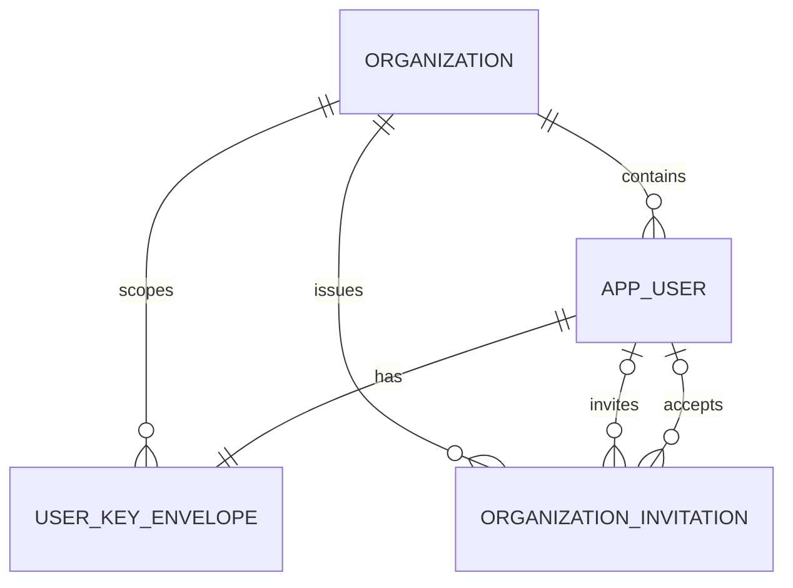
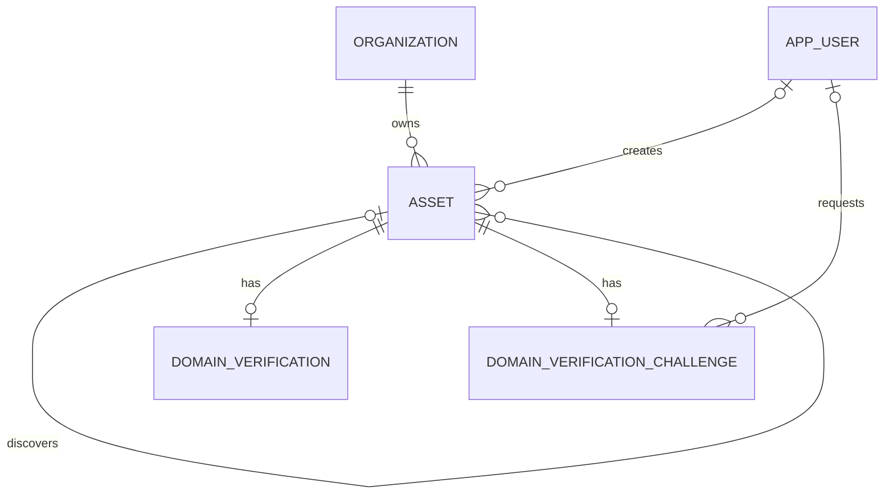
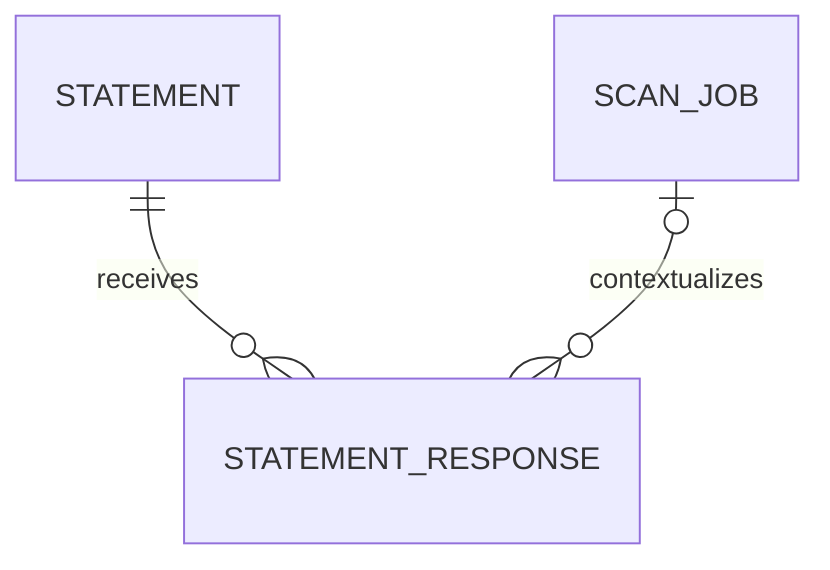
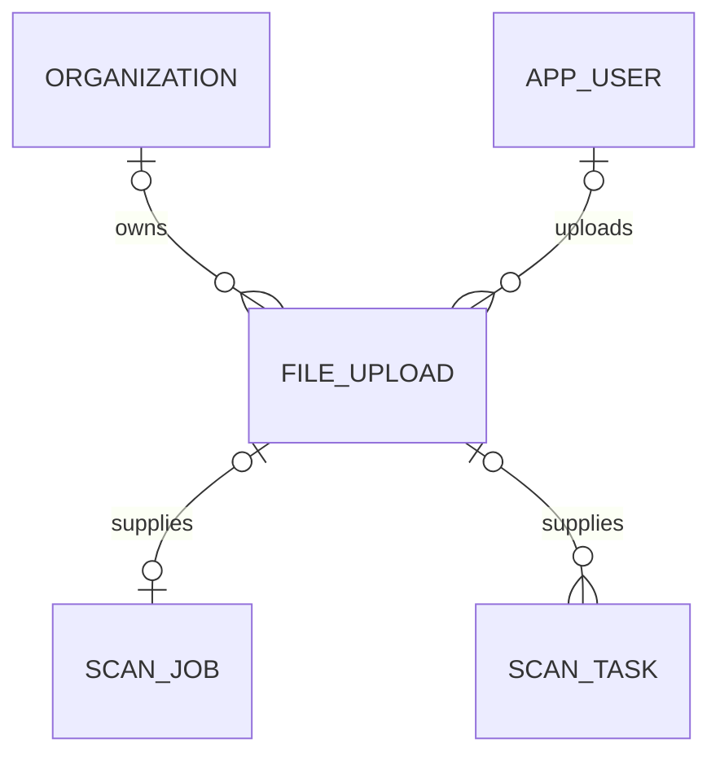
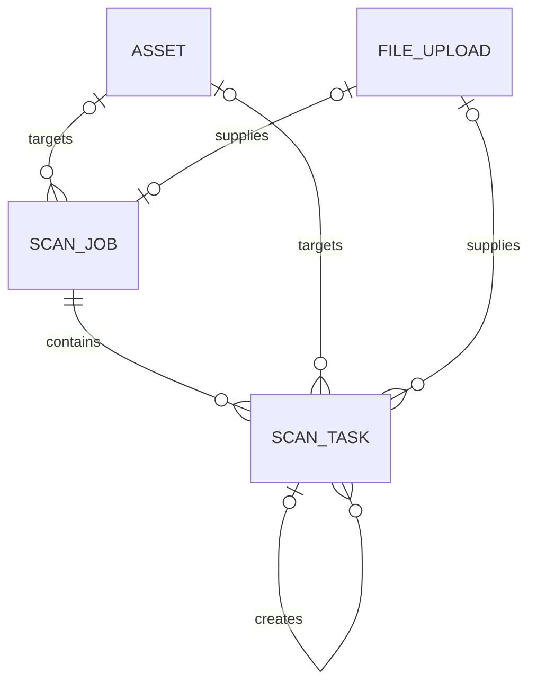
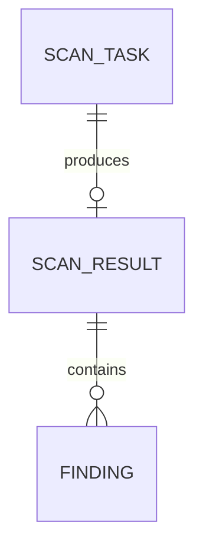
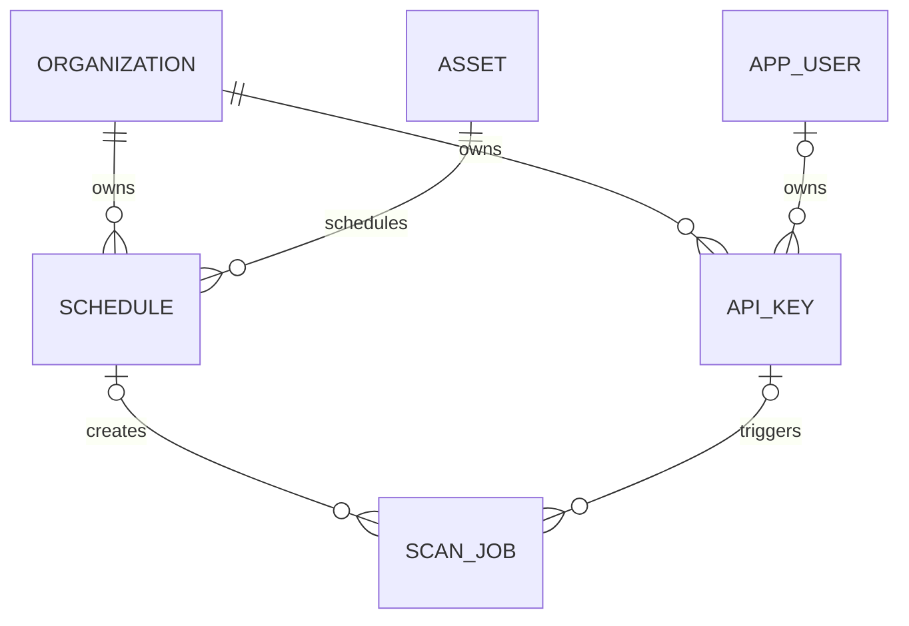
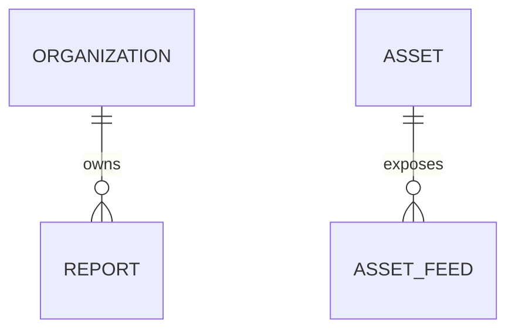
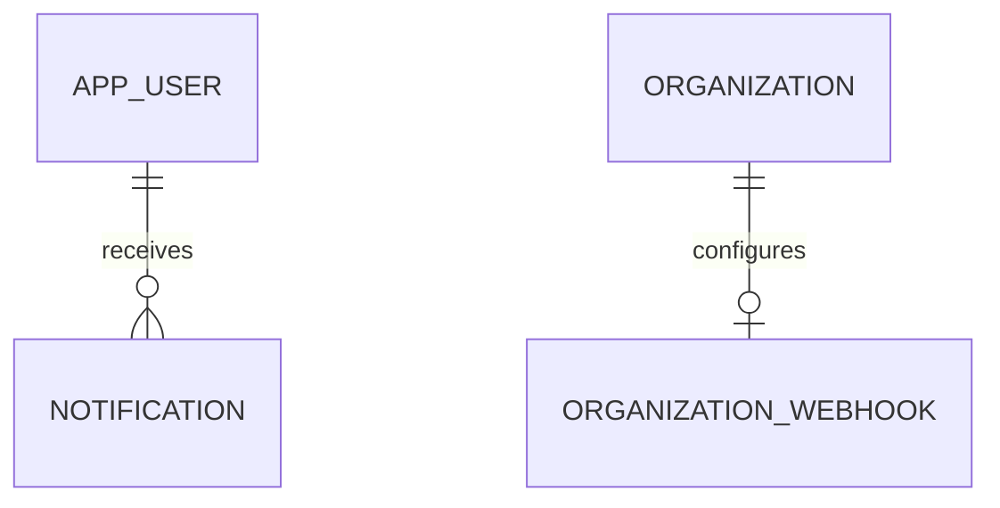
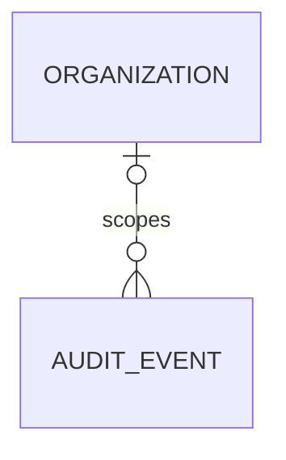

# Data model — v4.0.1 MVP

**Status:** delivery candidate **Database:** PostgreSQL

**Scope:** Based on NC3 Testing Platform v4.0 (MVP) requirements; entities, columns, and constraints.

## 1. Scope, terminology, and system boundaries

Conventions:

- Entity names are singular. Database identifiers use `snake_case`.
- Primary keys are UUIDv7 values, so primary-key order is creation order; list pagination keysets on `id`.
- Timestamps use UTC `timestamptz`.
- Retention is evaluated per data class, processing purpose, lifecycle anchor event, applicable policy version, and disposition at the deadline. No single timestamp is the complete lifecycle model.
- System-boundary references and copied envelope identifiers without foreign keys are not ER links.

### 1.1 Terminology

| Term                   | Meaning in this model                                                                                                                                                                      |
|------------------------|--------------------------------------------------------------------------------------------------------------------------------------------------------------------------------------------|
| Organization           | Tenant boundary. Registered users, assets, scan history, schedules, reports, API keys, and organization settings belong to one organization.                                               |
| AppUser                | The single local user entity. References one identity-provider identity and stores platform-owned user and organization fields.                                                            |
| UserKeyEnvelope        | Mutable one-to-one record containing a per-user KEK encrypted by the deployment master key. Deleting it makes retained user evidence unrecoverable.                                        |
| Asset                  | Organization-owned monitored target. v4.0 assets are domains.                                                                                                                              |
| OrganizationInvitation | Pending invitation to join one organization with one organization role.                                                                                                                    |
| ScanJob                | One submitted scan request.                                                                                                                                                                |
| ScanTask               | Persisted execution of one executable test against one domain or one uploaded file. Represents fan-out, independent task state, and partial results.                                       |
| Statement              | Versioned text requiring an explicit acceptance or attestation.                                                                                                                            |
| StatementResponse      | Immutable response record for one Statement, optionally bound to a model context such as a ScanJob. Acceptance and attestation share the receipt shape but remain distinct response kinds. |
| FileUpload             | Metadata for one uploaded file. The file bytes are temporary and are not retained with the scan result.                                                                                    |
| AssetFeed              | Persistent per-asset RSS or Atom feed configuration with a revocable access token.                                                                                                         |
| Notification           | User-owned in-app inbox item.                                                                                                                                                              |
| OrganizationWebhook    | Optional singular integration endpoint configured by one organization.                                                                                                                     |

`scan_task.test_key` names an executable test. `finding.check_id` names the stable diagnostic rule. The specifications use `check` for both; this model separates them.

### 1.2 System boundaries

| Boundary                          | Input used by this model                                                                       | Output or reference stored here                                                                                                   |
|-----------------------------------|------------------------------------------------------------------------------------------------|-----------------------------------------------------------------------------------------------------------------------------------|
| Identity provider                 | Subject identifier, projected user claims, current MFA assurance, platform-administrator claim | `app_user.identity_subject` and user foreign keys. MFA assurance and platform-administrator status are evaluated at request time. |
| Executable-test registry          | Test key, version, module, classification, configuration schema, result schema                 | Immutable execution metadata copied to `scan_task`.                                                                               |
| Temporary file storage            | Uploaded file bytes referenced by a storage key; purge completion                              | `file_upload` metadata, storage reference, and purge timestamps.                                                                  |
| Scan queue and workers            | `scan_task.id` as the queue task identifier, plus task configuration                           | Task status, cancellation outcome, `scan_result`, and `finding` rows. Queue topology and transport stay queue-owned.              |
| Deployment master-key file        | Versioned 256-bit master key mounted read-only at `/run/secrets/app_encryption_master_key`     | Used in memory to encrypt or decrypt `user_key_envelope.wrapped_kek`. Only `master_key_version` is stored in PostgreSQL.          |
| Anti-abuse controls               | Guest, user, organization, and target identifiers                                              | Allow or deny outcome. Rate-limit and cooldown counters stay in the anti-abuse subsystem.                                         |
| Report renderer and feed endpoint | Retained scan data, report metadata, feed configuration                                        | `report` metadata and `asset_feed` configuration. Rendered files and feed responses are generated on demand.                      |

## 2. Enumerations

### 2.1 Organizations and users

| Used by                               | PostgreSQL type     | Values                         |
|---------------------------------------|---------------------|--------------------------------|
| `app_user`, `organization_invitation` | `organization_role` | `member`, `organization_admin` |

### 2.2 Assets and verification

| Used by                                                | PostgreSQL type      | Values                |
|--------------------------------------------------------|----------------------|-----------------------|
| `asset`                                                | `asset_type`         | `domain`              |
| `asset`                                                | `asset_origin`       | `added`, `discovered` |
| `domain_verification`, `domain_verification_challenge` | `verification_scope` | `exact`, `zone`       |
| `domain_verification_challenge`                        | `dns_record_type`    | `TXT`                 |

`dns_record_type` values are uppercase.

### 2.3 Statements and responses

| Used by     | PostgreSQL type           | Values                      |
|-------------|---------------------------|-----------------------------|
| `statement` | `statement_response_kind` | `acceptance`, `attestation` |

### 2.4 Scan execution and results

| Used by                             | PostgreSQL type       | Values                                                                       |
|-------------------------------------|-----------------------|------------------------------------------------------------------------------|
| `scan_job`                          | `scan_source`         | `guest`, `manual`, `schedule`, `api`                                         |
| `scan_job`                          | `scan_job_status`     | `queued`, `running`, `completed`, `partial`, `failed`, `canceled`            |
| `scan_job`, `scan_task`, `schedule` | `scan_module`         | `email`, `web`, `file`, `pqc`, `dnssec`                                      |
| `scan_task`                         | `scan_classification` | `non_intrusive`, `intrusive`, `not_applicable`                               |
| `scan_task`                         | `scan_task_status`    | `queued`, `running`, `completed`, `failed`, `skipped`, `blocked`, `canceled` |
| `scan_result`                       | `scan_grade`          | `A+`, `A`, `B`, `C`, `D`, `F`                                                |
| `finding`                           | `finding_severity`    | `critical`, `high`, `medium`, `low`, `info`                                  |
| `finding`                           | `finding_status`      | `new`, `regression`, `persistent`, `resolved`                                |

### 2.5 API access, reporting, and notifications

| Used by      | PostgreSQL type         | Values                   |
|--------------|-------------------------|--------------------------|
| `api_key`    | `api_key_scope`         | `read_only`, `full_scan` |
| `report`     | `report_tier`           | `executive`, `technical` |
| `report`     | `technical_report_view` | `full`, `summary`        |
| `report`     | `report_format`         | `pdf`, `docx`, `json`    |
| `report`     | `report_language`       | `en`, `fr`, `de`         |
| `asset_feed` | `feed_format`           | `rss`, `atom`            |

Namespaced text values, not database enums: `statement_key`, `required_context_type`, `test_key`, `check_id`, `notification.type`, `scan_job.status_reason`, `scan_task.status_reason`, `audit_event.event_type`. Status-reason labels, descriptions, localization, and operator guidance are code-owned.

## 3. Organizations and users

### 3.1 `organization`

| Column               | Type        | Constraints            |
|----------------------|-------------|------------------------|
| `id`                 | UUID        | Primary key            |
| `name`               | text        | Not null               |
| `settings`           | JSONB       | Not null; default `{}` |
| `white_label_config` | JSONB       | Not null; default `{}` |
| `created_at`         | timestamptz | Not null               |
| `updated_at`         | timestamptz | Not null               |

### 3.2 `app_user`

| Column                        | Type                | Constraints                                |
|-------------------------------|---------------------|--------------------------------------------|
| `id`                          | UUID                | Primary key                                |
| `organization_id`             | UUID                | Not null; foreign key to `organization.id` |
| `identity_subject`            | text                | Not null; unique                           |
| `email`                       | text                | Not null                                   |
| `display_name`                | text                | Nullable                                   |
| `email_notifications_enabled` | boolean             | Not null; default `false`                  |
| `organization_role`           | `organization_role` | Not null                                   |
| `disabled_at`                 | timestamptz         | Nullable                                   |
| `created_at`                  | timestamptz         | Not null                                   |
| `updated_at`                  | timestamptz         | Not null                                   |

- A registered platform user belongs to exactly one organization.
- Platform-administrator status comes from the identity provider and is independent of the organization role.
- The identity provider stays the system of record for identity, credentials, authentication methods, sessions, and MFA enrollment.

### 3.3 `user_key_envelope`

Mutable one-to-one table storing one random per-user KEK, encrypted by the deployment master key. Key wrapping is application-owned. PostgreSQL stores only the wrapped KEK and its master-key version; plaintext keys exist only in application memory.

| Column               | Type        | Constraints                                                         |
|----------------------|-------------|---------------------------------------------------------------------|
| `id`                 | UUID        | Primary key; opaque envelope identifier                             |
| `organization_id`    | UUID        | Not null; foreign key to `organization.id`                          |
| `user_id`            | UUID        | Not null; unique; foreign key to `app_user.id`; `ON DELETE CASCADE` |
| `wrapped_kek`        | bytea       | Not null; user KEK encrypted by the deployment master key           |
| `wrapping_nonce`     | bytea       | Not null                                                            |
| `wrapping_algorithm` | text        | Not null                                                            |
| `master_key_version` | text        | Not null                                                            |
| `created_at`         | timestamptz | Not null                                                            |
| `updated_at`         | timestamptz | Not null                                                            |

Constraints:

- `id` is random and never reused. It must not encode an `app_user.id`, identity-provider subject, email address, or any other user identifier.
- `organization_id` equals the linked AppUser organization.
- Master-key rotation re-encrypts `wrapped_kek` and updates `master_key_version`. Retained audit and statement payloads are not re-encrypted.
- Deleting this row makes all DEKs wrapped by its user KEK unrecoverable.

Backup rules: the master-key backup is stored separately from PostgreSQL backups. Database backups containing deleted envelopes expire within 30 days. A restored backup must replay completed erasures before the service is exposed.

### 3.4 `organization_invitation`

| Column                | Type                | Constraints                                                  |
|-----------------------|---------------------|--------------------------------------------------------------|
| `id`                  | UUID                | Primary key                                                  |
| `organization_id`     | UUID                | Not null; foreign key to `organization.id`                   |
| `email`               | text                | Not null                                                     |
| `organization_role`   | `organization_role` | Not null                                                     |
| `token_hash`          | text                | Not null; unique; hash of the plaintext invitation token     |
| `invited_by_user_id`  | UUID                | Nullable; foreign key to `app_user.id`; `ON DELETE SET NULL` |
| `expires_at`          | timestamptz         | Not null                                                     |
| `accepted_by_user_id` | UUID                | Nullable; foreign key to `app_user.id`; `ON DELETE SET NULL` |
| `accepted_at`         | timestamptz         | Nullable                                                     |
| `revoked_at`          | timestamptz         | Nullable                                                     |
| `created_at`          | timestamptz         | Not null                                                     |

Rules:

- Only one unexpired, unaccepted, non-revoked invitation may exist for the same organization and normalized email address.
- The plaintext token is sent in the invitation link and is never stored.
- Acceptance is atomic. It requires an authenticated user whose verified email matches the invitation and who does not already belong to another organization. It sets `accepted_at` and `accepted_by_user_id` together; the latter may become null through user erasure.

### 3.5 User erasure treatment

Plain `app_user.id` values appear only where the reference can be removed during erasure. Retained evidence stores the opaque `user_key_envelope.id` value, without a foreign key to the envelope or the user.

| Reference category                     | Examples                                                                                | Erasure behavior                                                                                                                                              |
|----------------------------------------|-----------------------------------------------------------------------------------------|---------------------------------------------------------------------------------------------------------------------------------------------------------------|
| User-owned operational data            | Notifications and user-owned API keys                                                   | Delete with the user.                                                                                                                                         |
| Attribution on organization-owned data | Asset creator, scan trigger, verification requester, schedule creator, report generator | Keep the organization-owned row and set the user foreign key to null.                                                                                         |
| Immutable retained evidence            | Statement responses and audit events                                                    | Store no `app_user.id`. Encrypt identity and other user PII with a per-event DEK wrapped by the user-specific KEK. Delete `user_key_envelope` during erasure. |

Account erasure completes within 30 days. The workflow deletes `user_key_envelope`, deletes the `app_user` row and user-owned data, and nulls attribution references before the request is closed.

## 4. Assets and domain verification

### 4.1 `asset`

| Column                      | Type           | Constraints                                                                                       |
|-----------------------------|----------------|---------------------------------------------------------------------------------------------------|
| `id`                        | UUID           | Primary key                                                                                       |
| `organization_id`           | UUID           | Not null; foreign key to `organization.id`                                                        |
| `asset_type`                | `asset_type`   | Not null                                                                                          |
| `value`                     | text           | Not null; lowercase IDNA A-label domain without a trailing dot, canonicalized at the API boundary |
| `origin`                    | `asset_origin` | Not null                                                                                          |
| `parent_asset_id`           | UUID           | Nullable; foreign key to `asset.id`                                                               |
| `created_by_user_id`        | UUID           | Nullable; foreign key to `app_user.id`; `ON DELETE SET NULL`                                      |
| `regression_alerts_enabled` | boolean        | Not null; default `false`                                                                         |
| `created_at`                | timestamptz    | Not null                                                                                          |
| `updated_at`                | timestamptz    | Not null                                                                                          |

- Unique constraint: (`organization_id`, `asset_type`, `value`).
- An Asset is organization-owned. `created_by_user_id` records attribution and does not assign ownership.
- Deletion is restricted: an asset referenced by scan history or by discovered children answers `409`. Referencing foreign keys restrict, never cascade or set null.

Ownership is held in two tables. `domain_verification` records a proof that exists, and `domain_verification_challenge` records a challenge in progress. They are independent, so a domain keeps the coverage it has already proven while it re-proves ownership or asks for wider coverage.

### 4.2 `domain_verification`

| Column            | Type                 | Constraints                                 |
|-------------------|----------------------|---------------------------------------------|
| `id`              | UUID                 | Primary key                                 |
| `organization_id` | UUID                 | Not null; foreign key to `organization.id`  |
| `asset_id`        | UUID                 | Not null; unique; foreign key to `asset.id` |
| `verified_scope`  | `verification_scope` | Not null                                    |
| `verified_at`     | timestamptz          | Not null                                    |

Constraints:

- The referenced Asset must have `asset_type = domain`.
- A row exists exactly while the domain is proven, so proof is presence rather than a stored status.
- Zone coverage is evaluated by DNS-label ancestry, not by string suffix matching.
- A successful check writes this row and deletes the challenge that produced it in one transaction, so `verified_scope` changes only at the moment a wider coverage is actually proven.
- The API status is computed from the two tables: `verified` while this row exists, `pending` while a challenge is unexpired, and `expired` otherwise. No stored enum carries it.
- This table stores the current proof only. Verification attempts and status changes are recorded in `audit_event`.

### 4.3 `domain_verification_challenge`

| Column                 | Type                 | Constraints                                                  |
|------------------------|----------------------|--------------------------------------------------------------|
| `id`                   | UUID                 | Primary key                                                  |
| `organization_id`      | UUID                 | Not null; foreign key to `organization.id`                   |
| `asset_id`             | UUID                 | Not null; unique; foreign key to `asset.id`                  |
| `requested_scope`      | `verification_scope` | Not null                                                     |
| `record_type`          | `dns_record_type`    | Not null                                                     |
| `record_name`          | text                 | Not null; DNS name at which the token is published           |
| `verification_token`   | text                 | Not null; the complete record value                          |
| `token_expires_at`     | timestamptz          | Not null; seven days after issue by default                  |
| `requested_by_user_id` | UUID                 | Nullable; foreign key to `app_user.id`; `ON DELETE SET NULL` |
| `requested_at`         | timestamptz          | Not null                                                     |
| `last_recheck_at`      | timestamptz          | Nullable                                                     |
| `failure_code`         | text                 | Nullable                                                     |

Constraints:

- An asset has at most one challenge in progress, and a challenge may exist whether or not the asset is already proven.
- `record_name` is computed as `_<prefix>-verify.<domain>`, where the vendor prefix is deployment configuration.
- `verification_token` is the whole record value. A client publishes it verbatim.
- A challenge whose `token_expires_at` has passed answers no further checks. Reaching that deadline never touches an existing `domain_verification` row.
- Replacing the token is rejected while the asset has a `domain_verification` row. Re-proving ownership or widening scope starts a new challenge instead, and the existing proof holds until that challenge succeeds.
- `last_recheck_at` records the last time the record was looked for, whichever trigger caused it.
- `failure_code` records the outcome of the most recent check and is cleared when a check succeeds.
- The row is deleted when its check succeeds, so a spent token is never kept beside the proof it produced.

## 5. Statements and responses

One table pair stores all v4.0 declarations: account-level acceptance of Terms, AUP, and privacy text; per-launch attestation of ownership or permission; and per-launch acceptance of intrusive-scan risks and responsibility.

`statement` identifies and versions the exact text and the required response type. `statement_response` records an immutable receipt of the response and its optional model context. `response_kind` distinguishes acceptance from factual attestation without creating separate ledgers.

### 5.1 `statement`

| Column                  | Type                      | Constraints                                                                             |
|-------------------------|---------------------------|-----------------------------------------------------------------------------------------|
| `id`                    | UUID                      | Primary key                                                                             |
| `statement_key`         | text                      | Not null                                                                                |
| `version`               | text                      | Not null                                                                                |
| `response_kind`         | `statement_response_kind` | Not null                                                                                |
| `required_context_type` | text                      | Nullable; null for account-level responses; `scan_job` for per-launch responses in v4.0 |
| `content_hash`          | text                      | Not null                                                                                |
| `content_uri`           | text                      | Nullable                                                                                |
| `effective_at`          | timestamptz               | Not null                                                                                |
| `retired_at`            | timestamptz               | Nullable                                                                                |

Unique constraint: (`statement_key`, `version`).

Expected `statement_key` values:

| `statement_key`                 | `response_kind` | `required_context_type` |
|---------------------------------|-----------------|-------------------------|
| `terms_and_conditions`          | `acceptance`    | null                    |
| `acceptable_use_policy`         | `acceptance`    | null                    |
| `privacy_notice`                | `acceptance`    | null                    |
| `scan_target_permission`        | `attestation`   | `scan_job`              |
| `intrusive_scan_risk_liability` | `acceptance`    | `scan_job`              |

### 5.2 `statement_response`

| Column                        | Type        | Constraints                                                                         |
|-------------------------------|-------------|-------------------------------------------------------------------------------------|
| `id`                          | UUID        | Primary key                                                                         |
| `organization_id`             | UUID        | Nullable; foreign key to `organization.id`                                          |
| `statement_id`                | UUID        | Not null; foreign key to `statement.id`                                             |
| `envelope_id`                 | UUID        | Not null; copied from `user_key_envelope.id` at write time; no foreign key retained |
| `context_type`                | text        | Nullable; namespaced value                                                          |
| `context_id`                  | UUID        | Nullable                                                                            |
| `responded_at`                | timestamptz | Not null                                                                            |
| `response_evidence_encrypted` | bytea       | Not null; encrypted actor identity, IP address, user agent, and response evidence   |
| `wrapped_dek`                 | bytea       | Not null; per-response DEK wrapped by the user-specific KEK                         |
| `encryption_metadata`         | JSONB       | Not null; payload-encryption and DEK-wrapping algorithm and nonce metadata          |

Constraints:

- `envelope_id` equals the responding user's `user_key_envelope.id` at write time. No foreign key is retained.
- `envelope_id` is opaque and never reused. It must not encode an `app_user.id`, identity-provider subject, email address, or any other user identifier.
- `context_type` and `context_id` are either both null or both non-null.
- When `statement.required_context_type` is null: both context columns are null, and the response is unique on (`statement_id`, `envelope_id`).
- When `statement.required_context_type` is non-null: `context_type` equals that value, and the response is unique on (`statement_id`, `context_type`, `context_id`).
- When `context_type = scan_job`: `context_id` identifies a ScanJob, `organization_id` equals the ScanJob organization, and the envelope belongs to the user who submitted the launch at response time.
- StatementResponse rows are immutable. A correction requires a new Statement version and a new response. Application roles have no `UPDATE` or `DELETE` permission on this table.
- Each StatementResponse is recorded in `audit_event`.
- User erasure deletes the applicable `user_key_envelope` and the `app_user` row. The StatementResponse remains, but its actor evidence cannot be decrypted, and no user foreign key survives.
- `statement.response_kind` identifies which action the user performed. `statement_key`, `version`, and `content_hash` identify the exact text.

## 6. File uploads

### 6.1 `file_upload`

| Column                | Type        | Constraints                                                      |
|-----------------------|-------------|------------------------------------------------------------------|
| `id`                  | UUID        | Primary key                                                      |
| `organization_id`     | UUID        | Nullable; foreign key to `organization.id`                       |
| `uploaded_by_user_id` | UUID        | Nullable; foreign key to `app_user.id`; `ON DELETE SET NULL`     |
| `original_filename`   | text        | Not null                                                         |
| `declared_mime_type`  | text        | Nullable                                                         |
| `detected_mime_type`  | text        | Not null                                                         |
| `size_bytes`          | bigint      | Not null; maximum 50 MB under the default platform configuration |
| `sha256`              | text        | Not null                                                         |
| `storage_key`         | text        | Nullable; required while file bytes exist                        |
| `uploaded_at`         | timestamptz | Not null                                                         |
| `purge_due_at`        | timestamptz | Not null; no later than 24 hours after upload                    |
| `purged_at`           | timestamptz | Nullable                                                         |

Constraints:

- At creation, both ownership fields are null for a guest upload. When the associated guest ScanJob is claimed, both are set to the claimed organization and the claiming user.
- At creation, both ownership fields are set for a registered-user upload. `uploaded_by_user_id` may later become null through user erasure.
- File bytes are purged after analysis, or when `purge_due_at` is reached.
- `storage_key` is null after purge. It must never resolve to a browser-accessible path.
- Scan results follow the retention defined by `scan_job.purge_at` in §7.1 after the file bytes are purged.
- An accepted file-scan launch creates the `file_upload`, `scan_job`, and initial File `scan_task` rows as one application operation, after raw-byte validation. A rejected upload leaves no durable FileUpload row.
- One FileUpload supplies at most one ScanJob. That ScanJob may fan out to multiple File ScanTasks: hash triage, deep analysis, metadata extraction, mismatch detection.

## 7. Scan execution

### 7.1 `scan_job`

| Column                 | Type              | Constraints                                                                                         |
|------------------------|-------------------|-----------------------------------------------------------------------------------------------------|
| `id`                   | UUID              | Primary key                                                                                         |
| `organization_id`      | UUID              | Nullable; foreign key to `organization.id`                                                          |
| `triggered_by_user_id` | UUID              | Nullable; foreign key to `app_user.id`; `ON DELETE SET NULL`                                        |
| `source`               | `scan_source`     | Not null                                                                                            |
| `schedule_id`          | UUID              | Nullable; foreign key to `schedule.id`                                                              |
| `api_key_id`           | UUID              | Nullable; foreign key to `api_key.id`                                                               |
| `asset_id`             | UUID              | Nullable; foreign key to `asset.id`                                                                 |
| `target_domain`        | text              | Nullable; lowercase IDNA A-label domain not stored as an Asset                                      |
| `file_upload_id`       | UUID              | Nullable; unique when present; foreign key to `file_upload.id`                                      |
| `modules`              | `scan_module[]`   | Not null; what the launch asked for. Compare against the tasks to see what ran                      |
| `module_configuration` | JSONB             | Not null; default `{}`                                                                              |
| `status`               | `scan_job_status` | Not null                                                                                            |
| `status_reason`        | text              | Nullable; stable namespaced reason code for job-wide exceptional or terminal outcomes               |
| `claim_token_hash`     | text              | Nullable; hash of the one-time token returned by an unauthenticated launch                          |
| `claimed_by_user_id`   | UUID              | Nullable; foreign key to `app_user.id`; `ON DELETE SET NULL`                                        |
| `claimed_at`           | timestamptz       | Nullable                                                                                            |
| `purge_at`             | timestamptz       | Nullable until terminal completion, except on an unclaimed guest job; final hard-deletion timestamp |
| `created_at`           | timestamptz       | Not null                                                                                            |
| `started_at`           | timestamptz       | Nullable                                                                                            |
| `finished_at`          | timestamptz       | Nullable                                                                                            |

Retention:

- `purge_at` is the final deletion boundary, not the start of a grace period. On terminal completion it is set to
  `finished_at + 12 months + 30 days` by default.
- The application notifies responsible organization users 30 days before it, hard-deletes the scan data at that timestamp, and records an audit event for each extension.
- An unclaimed guest job's `purge_at` is `created_at + 24 hours`, set at creation. A successful claim recomputes `purge_at` under the rule above, and the 30-day notice applies from that point.
- Purging at the deadline does not wait for the job to finish; unfinished work is terminated first.
- How far one extension moves the deadline is deployment configuration, not schema. No retention-policy entity or database partition policy is part of v4.0.

Constraints:

- Exactly one of `asset_id`, `target_domain`, and `file_upload_id` is set.
- Authenticated domain launches use `asset_id`. Unauthenticated domain launches use the guest JSON variant and populate `target_domain`. File launches use the multipart transport and populate `file_upload_id`. No `asset_id | target | file` request union exists.
- `file_upload_id` is present only for File-module jobs.
- `target_domain` is populated only by unauthenticated guest domain launches. Guest jobs are limited to non-intrusive tests. A guest target is never an Asset row.
- `source = schedule` requires `schedule_id`.
- `source = api` requires `api_key_id`.
- At creation, `source = manual` requires `triggered_by_user_id`. The reference may later become null through user erasure.
- Guest jobs have no organization and no triggering user until claimed after registration.
- `claim_token_hash` is set on an unauthenticated launch and holds the hash of a 256-bit random token returned once to
  the caller. The plaintext is never stored.
- Claiming is one atomic compare-and-set: the job is an unclaimed guest job, the supplied token hashes to `claim_token_hash`, and `purge_at` has not passed. Success sets `claimed_at`, `claimed_by_user_id`, the ownership fields, and nulls `claim_token_hash`. The same token reads the job before it is claimed, and reading leaves it usable.
- A claimed job carries `claimed_at` and an `organization_id`, the organization of the claiming user. `claimed_by_user_id` records who claimed it and may later become null through user erasure. For a file ScanJob, the claim also sets `file_upload.organization_id` and `file_upload.uploaded_by_user_id`.
- A job containing an intrusive ScanTask requires current `statement_response` rows for both `scan_target_permission` and `intrusive_scan_risk_liability`, each bound to that ScanJob. The responding user is the user who submitted the intrusive launch and belongs to the ScanJob organization.

### 7.2 `scan_task`

| Column                      | Type                  | Constraints                                                                                |
|-----------------------------|-----------------------|--------------------------------------------------------------------------------------------|
| `id`                        | UUID                  | Primary key                                                                                |
| `organization_id`           | UUID                  | Nullable; foreign key to `organization.id`                                                 |
| `scan_job_id`               | UUID                  | Not null; foreign key to `scan_job.id`                                                     |
| `parent_task_id`            | UUID                  | Nullable; foreign key to `scan_task.id`                                                    |
| `module`                    | `scan_module`         | Not null                                                                                   |
| `test_key`                  | text                  | Not null                                                                                   |
| `test_version`              | text                  | Not null                                                                                   |
| `classification`            | `scan_classification` | Not null                                                                                   |
| `target_asset_id`           | UUID                  | Nullable; foreign key to `asset.id`                                                        |
| `target_domain`             | text                  | Nullable                                                                                   |
| `file_upload_id`            | UUID                  | Nullable; foreign key to `file_upload.id`                                                  |
| `configuration`             | JSONB                 | Not null; default `{}`                                                                     |
| `status`                    | `scan_task_status`    | Not null                                                                                   |
| `status_reason`             | text                  | Nullable; stable namespaced reason code for failed, skipped, blocked, or canceled outcomes |
| `cancellation_requested_at` | timestamptz           | Nullable                                                                                   |
| `created_at`                | timestamptz           | Not null                                                                                   |
| `started_at`                | timestamptz           | Nullable                                                                                   |
| `finished_at`               | timestamptz           | Nullable                                                                                   |

Constraints:

- Exactly one of `target_asset_id`, `target_domain`, and `file_upload_id` is set.
- `test_key`, `test_version`, and `classification` are copied from the code-owned executable-test definition when the task is created.
- `classification = not_applicable` is used only by the File module.
- `status_reason` is required when `status = blocked`.
- `parent_task_id` records discovery and fan-out lineage for all-in-one scans.
- `scan_task.id` is supplied as the queue task identifier. No second queue-job identifier is stored.
- Setting `cancellation_requested_at` records durable cancellation intent. The queue task is revoked using `scan_task.id`. Workers check cancellation before starting and at safe interruption points.
- After cancellation is accepted: `status = canceled`, `finished_at` is set, and a later successful result is rejected.

### 7.3 v4.0 executable-test catalog

Owned by application code. Metadata is copied into `scan_task` at task creation.

| `test_key`                  | Module | Classification   | Produces a letter grade |
|-----------------------------|--------|------------------|-------------------------|
| `email.mailvalidator`       | Email  | `non_intrusive`  | Yes                     |
| `web.headers`               | Web    | `non_intrusive`  | Yes                     |
| `web.tls`                   | Web    | `non_intrusive`  | Yes                     |
| `web.subdomain_enumeration` | Web    | `non_intrusive`  | No                      |
| `file.hashlookup`           | File   | `not_applicable` | No                      |
| `file.pandora`              | File   | `not_applicable` | No                      |
| `file.metadata`             | File   | `not_applicable` | No                      |
| `file.mime_check`           | File   | `not_applicable` | No                      |
| `pqc.quantumvalidator`      | PQC    | `non_intrusive`  | No                      |
| `dnssec.chainvalidator`     | DNSSEC | `non_intrusive`  | No                      |

No v4.0 executable test has `classification = intrusive`.

## 8. Results and findings

### 8.1 `scan_result`

| Column            | Type         | Constraints                                     |
|-------------------|--------------|-------------------------------------------------|
| `id`              | UUID         | Primary key                                     |
| `organization_id` | UUID         | Nullable; foreign key to `organization.id`      |
| `scan_task_id`    | UUID         | Not null; unique; foreign key to `scan_task.id` |
| `schema_version`  | text         | Not null                                        |
| `raw_output`      | JSONB        | Not null                                        |
| `summary`         | JSONB        | Not null; default `{}`                          |
| `grade`           | `scan_grade` | Nullable                                        |
| `severity_counts` | JSONB        | Nullable                                        |
| `completed_at`    | timestamptz  | Not null                                        |

Constraints:

- `grade` is used only for Email, Web headers, and Web TLS tasks.
- Non-graded tasks use severity counts or per-step verdicts in `summary`.
- No cross-module composite score is stored.

### 8.2 `finding`

| Column                | Type               | Constraints                                 |
|-----------------------|--------------------|---------------------------------------------|
| `id`                  | UUID               | Primary key                                 |
| `organization_id`     | UUID               | Nullable; foreign key to `organization.id`  |
| `scan_result_id`      | UUID               | Not null; foreign key to `scan_result.id`   |
| `check_id`            | text               | Not null; stable diagnostic-rule identifier |
| `severity`            | `finding_severity` | Not null                                    |
| `status`              | `finding_status`   | Not null                                    |
| `title`               | text               | Not null                                    |
| `description`         | text               | Not null                                    |
| `affected_resource`   | text               | Nullable                                    |
| `remediation`         | text               | Nullable                                    |
| `evidence`            | JSONB              | Nullable                                    |
| `external_references` | JSONB              | Not null; default                           |

- Index: (`scan_result_id`, `check_id`).
- `finding.status` persists the derived historical-comparison classification with the result projection.
- `check_id` is stable across result-schema versions.
- When one diagnostic rule produces several findings, regression matching also uses the normalized `affected_resource`.
- A resolved prior finding is represented by a Finding row on the newer result that establishes the resolution.

## 9. Scheduling and API access

### 9.1 `schedule`

| Column                 | Type            | Constraints                                                  |
|------------------------|-----------------|--------------------------------------------------------------|
| `id`                   | UUID            | Primary key                                                  |
| `organization_id`      | UUID            | Not null; foreign key to `organization.id`                   |
| `asset_id`             | UUID            | Not null; foreign key to `asset.id`                          |
| `created_by_user_id`   | UUID            | Nullable; foreign key to `app_user.id`; `ON DELETE SET NULL` |
| `modules`              | `scan_module[]` | Not null                                                     |
| `module_configuration` | JSONB           | Not null; default `{}`                                       |
| `recurrence_rule`      | text            | Not null; RFC 5545 RRULE                                     |
| `timezone`             | text            | Not null; IANA timezone                                      |
| `enabled`              | boolean         | Not null; default `true`                                     |
| `next_run_at`          | timestamptz     | Nullable                                                     |
| `created_at`           | timestamptz     | Not null                                                     |
| `updated_at`           | timestamptz     | Not null                                                     |

- A Schedule creates ScanJob rows. It does not store scan results.
- `timezone` is stored separately from `recurrence_rule`.

### 9.2 `api_key`

| Column               | Type            | Constraints                                                                               |
|----------------------|-----------------|-------------------------------------------------------------------------------------------|
| `id`                 | UUID            | Primary key                                                                               |
| `organization_id`    | UUID            | Not null; foreign key to `organization.id`                                                |
| `owner_user_id`      | UUID            | Nullable; foreign key to `app_user.id`; `ON DELETE CASCADE`; null for an organization key |
| `created_by_user_id` | UUID            | Nullable; foreign key to `app_user.id`; `ON DELETE SET NULL`                              |
| `name`               | text            | Not null                                                                                  |
| `scope`              | `api_key_scope` | Not null                                                                                  |
| `key_prefix`         | text            | Not null; unique                                                                          |
| `secret_hash`        | text            | Not null                                                                                  |
| `expires_at`         | timestamptz     | Nullable                                                                                  |
| `revoked_at`         | timestamptz     | Nullable                                                                                  |
| `revocation_reason`  | text            | Nullable                                                                                  |
| `last_used_at`       | timestamptz     | Nullable                                                                                  |
| `created_at`         | timestamptz     | Not null                                                                                  |

Rules:

- The plaintext key is never stored.
- Key-management actions consume current MFA assurance from the identity provider.
- Account erasure revokes and deletes user-owned keys. The revocation stays represented by the audit event.

## 10. Reports and feeds

### 10.1 `report`

| Column                 | Type                    | Constraints                                                  |
|------------------------|-------------------------|--------------------------------------------------------------|
| `id`                   | UUID                    | Primary key                                                  |
| `organization_id`      | UUID                    | Not null; foreign key to `organization.id`                   |
| `tier`                 | `report_tier`           | Not null                                                     |
| `technical_view`       | `technical_report_view` | Nullable; used only when `tier = technical`                  |
| `format`               | `report_format`         | Not null                                                     |
| `language`             | `report_language`       | Not null                                                     |
| `source_scan_job_id`   | UUID                    | Nullable; provenance identifier; deliberately no foreign key |
| `source_scan_task_id`  | UUID                    | Nullable; provenance identifier; deliberately no foreign key |
| `generated_by_user_id` | UUID                    | Nullable; foreign key to `app_user.id`; `ON DELETE SET NULL` |
| `generated_at`         | timestamptz             | Not null                                                     |

Rules:

- Exactly one of `source_scan_job_id` and `source_scan_task_id` is set.
- The application validates the source at generation time and reads results through ordinary joins in the generation query.
- The selected identifier remains as provenance metadata after the scan data is purged. From that point, no further report can be generated from that source.
- The rendered artifact is generated on demand and is not stored.

### 10.2 `asset_feed`

| Column               | Type          | Constraints                                                  |
|----------------------|---------------|--------------------------------------------------------------|
| `id`                 | UUID          | Primary key                                                  |
| `organization_id`    | UUID          | Not null; foreign key to `organization.id`                   |
| `asset_id`           | UUID          | Not null; foreign key to `asset.id`                          |
| `format`             | `feed_format` | Not null                                                     |
| `token_hash`         | text          | Not null                                                     |
| `created_by_user_id` | UUID          | Nullable; foreign key to `app_user.id`; `ON DELETE SET NULL` |
| `revoked_at`         | timestamptz   | Nullable                                                     |
| `last_used_at`       | timestamptz   | Nullable                                                     |
| `created_at`         | timestamptz   | Not null                                                     |

The plaintext feed token is not stored. The feed is read-only and per Asset.

## 11. Notifications and webhooks

### 11.1 `notification`

| Column           | Type        | Constraints                                                 |
|------------------|-------------|-------------------------------------------------------------|
| `id`             | UUID        | Primary key                                                 |
| `user_id`        | UUID        | Not null; foreign key to `app_user.id`; `ON DELETE CASCADE` |
| `type`           | text        | Not null; stable namespaced notification type               |
| `schema_version` | text        | Not null; version of this type's `data` shape               |
| `data`           | JSONB       | Not null; default `{}`                                      |
| `read_at`        | timestamptz | Nullable                                                    |
| `created_at`     | timestamptz | Not null                                                    |

Rules:

- A Notification is owned by one user.
- Recipient selection is feature-specific application logic.
- In-app delivery is mandatory. Clearing or dismissing a v4.0 notification hard-deletes that user's row.
- Email delivery is attempted only when `app_user.email_notifications_enabled` is true.
- Canonical v4.0 types include verification completion, regressions, scan completion and failure, retention warnings, and token expiry. The type vocabulary is code-owned.

### 11.2 `organization_webhook`

| Column                     | Type        | Constraints                                                  |
|----------------------------|-------------|--------------------------------------------------------------|
| `id`                       | UUID        | Primary key                                                  |
| `organization_id`          | UUID        | Not null; unique; foreign key to `organization.id`           |
| `endpoint_url_encrypted`   | bytea       | Not null                                                     |
| `signing_secret_encrypted` | bytea       | Not null                                                     |
| `created_by_user_id`       | UUID        | Nullable; foreign key to `app_user.id`; `ON DELETE SET NULL` |
| `created_at`               | timestamptz | Not null                                                     |
| `updated_at`               | timestamptz | Not null                                                     |

Rules:

- An organization has zero or one webhook configuration. Deleting the row disables the integration.
- Payload `schema_version` belongs to the signed webhook contract, not to this table.
- Delivery retries and backoff are application/outbox concerns. No `webhook_delivery` entity is required.

## 12. Audit log

User identity and other user PII are never stored as clear foreign keys in immutable audit rows:

1. A per-event data-encryption key (DEK) encrypts the sensitive payload.
2. The DEK is wrapped by the user-specific KEK, which is stored encrypted in `user_key_envelope`.
3. The application unwraps that KEK using the deployment master key mounted at `/run/secrets/app_encryption_master_key`.

For user-related events, `envelope_id` is copied from `user_key_envelope.id` at write time. It is not a foreign key and contains no user identifier. Deleting `user_key_envelope` removes both the usable user KEK and its link to the AppUser, without updating or deleting the audit event.

### 12.1 `audit_event`

| Column                | Type        | Constraints                                                                            |
|-----------------------|-------------|----------------------------------------------------------------------------------------|
| `id`                  | UUID        | Primary key                                                                            |
| `organization_id`     | UUID        | Nullable; foreign key to `organization.id`                                             |
| `chain_id`            | text        | Not null; organization or platform chain identifier                                    |
| `sequence_number`     | bigint      | Not null                                                                               |
| `event_type`          | text        | Not null; namespaced value                                                             |
| `subject_type`        | text        | Nullable; must not identify an AppUser                                                 |
| `subject_id`          | UUID        | Nullable; may reference a non-user model entity only                                   |
| `detail`              | JSONB       | Nullable; structured operational detail containing no PII                              |
| `payload_encrypted`   | bytea       | Nullable; encrypted identity, IP address, user agent, and other sensitive event detail |
| `wrapped_dek`         | bytea       | Nullable; per-event DEK wrapped by the user-specific KEK                               |
| `envelope_id`         | UUID        | Nullable; copied from `user_key_envelope.id` at write time; no foreign key retained    |
| `encryption_metadata` | JSONB       | Nullable; payload-encryption and DEK-wrapping algorithm and nonce metadata             |
| `occurred_at`         | timestamptz | Not null                                                                               |
| `previous_hash`       | text        | Nullable                                                                               |
| `entry_hash`          | text        | Not null                                                                               |
| `retention_until`     | timestamptz | Not null; default 24 months after `occurred_at`                                        |

Unique constraint: (`chain_id`, `sequence_number`).

Constraints:

- Rows are append-only. Application roles have no `UPDATE` or `DELETE` permission.
- Audit events are retained for 24 months.
- Only platform administrators may read the audit log.
- User identity is stored only inside `payload_encrypted`.
- `chain_id` identifies an organization or platform chain, never a user chain.
- `detail` may contain non-PII operational values: status, counts, model identifiers. User identity, email, IP address, user agent, domains, and other PII belong in `payload_encrypted`, or are represented through a non-user `subject_id`.
- An event may contain `detail`, an encrypted payload, or both.
- `payload_encrypted`, `wrapped_dek`, `envelope_id`, and `encryption_metadata` are either all null or all non-null.
- For a user-related event, `envelope_id` equals the user's `user_key_envelope.id` at write time, but no foreign key constrains it.
- `envelope_id` is opaque and never reused. It must not encode an `app_user.id`, identity-provider subject, email address, or any other user identifier.
- One encrypted user-specific payload contains PII for at most one user. An operation involving PII for two users emits separately encrypted audit events.
- Deleting the applicable `user_key_envelope` makes the encrypted event detail inaccessible without deleting the audit row.
- `entry_hash` covers `previous_hash` and the canonical stored representation of the event, including `detail`, `payload_encrypted`, `wrapped_dek`, `envelope_id`, and `encryption_metadata`.
- `chain_id` and `sequence_number` define deterministic ordering within each organization or platform chain.

The same user KEK wraps the per-response DEKs used by `statement_response`. Deleting `user_key_envelope` crypto-shreds retained response evidence and retained audit identity data in one erasure operation.

## 13. Cross-entity constraints

1. Every organization-owned row carries `organization_id`. Guest scan rows may have a null `organization_id`. Foreign keys between organization-owned rows must reference rows in the same organization.
2. Row-level security is enforced on all organization-owned tables. `scan_task`, `scan_result`, and `finding` copy `organization_id` from `scan_job`. The value is rechecked when asynchronous results are written.
3. `asset.asset_type` is restricted to `domain` in v4.0.
4. A DomainVerification covers an intrusive target only when a `domain_verification` row exists for the asset and its `verified_scope` covers that target.
5. Domain re-verification occurs before an intrusive ScanTask is queued. The outcome is recorded in `domain_verification`, `domain_verification_challenge`, and `audit_event`, not in a separate authorization table.
6. Current MFA assurance is read from the identity-provider session or token. It is not persisted as a User boolean.
7. A ScanJob containing an intrusive ScanTask requires two current StatementResponse rows bound to that ScanJob: an attestation for `scan_target_permission` and an acceptance for `intrusive_scan_risk_liability`.
8. All v4.0 domain ScanTasks are non-intrusive. File ScanTasks use `classification = not_applicable`.
9. Guest ScanJobs are not shown in persistent history unless they are claimed after registration.
10. On terminal completion, `scan_job.purge_at` is set to `finished_at + 12 months + 30 days` by default. An unclaimed guest job's `purge_at` is instead `created_at + 24 hours`, set at creation, and a successful claim recomputes the timestamp under the default rule. Scan data is hard-deleted at `purge_at` regardless of job status, with unfinished work terminated first; the application sends notice 30 days beforehand, and that notice applies to a guest job only once it is claimed. Uploaded file bytes are purged after analysis or within 24 hours. Audit events are retained for 24 months.
11. Report rows store generation and source-provenance metadata only. Rendered artifacts are generated from retained scan data. After the source is purged, the metadata may remain, but another report cannot be generated from that source.
12. Finding regression comparison uses stable `check_id` values and, where required, normalized `affected_resource` values. A change to a `check_id` is a breaking result-schema change.
13. Deleting an AppUser cascades `user_key_envelope`, notifications, and other user-owned operational data, sets organization-owned attribution references to null, and leaves no plain AppUser identifier in retained StatementResponse or AuditEvent rows.
14. Invitation acceptance requires a matching verified email and atomically assigns the invitation organization and role. An existing member of another organization cannot accept.
15. `scan_task.id` is the queue task identifier. Durable cancellation intent is stored in `scan_task.cancellation_requested_at`. A canceled task cannot later produce an accepted successful result.

## 14. Row-level check constraints

Every constraint below enforces an invariant already stated in the table sections, and each is expressible as a PostgreSQL `CHECK` on one row, so the DDL carries it instead of application discipline. Between two null tests, `=` reads "exactly when". Where §3.5 erasure nulls an attribution column, the pairing is one-way instead: the actor implies the time, never the reverse, so erasing a user cannot violate the constraint. Cross-row and cross-table rules stay in §13.

| Table                           | Constraint                                                                                                                         | Enforces                                                              |
|---------------------------------|------------------------------------------------------------------------------------------------------------------------------------|-----------------------------------------------------------------------|
| `organization_invitation`       | `accepted_by_user_id IS NULL OR accepted_at IS NOT NULL`                                                                           | an acceptance actor implies an acceptance time                        |
| `asset`                         | `parent_asset_id IS NULL OR origin = 'discovered'`                                                                                 | only discovery produces child assets                                  |
| `domain_verification_challenge` | `failure_code IS NULL OR last_recheck_at IS NOT NULL`                                                                              | a failure code always follows a recorded check                        |
| `file_upload`                   | `(purged_at IS NULL) = (storage_key IS NOT NULL)`                                                                                  | the storage reference exists exactly while the bytes do               |
| `file_upload`                   | `uploaded_by_user_id IS NULL OR organization_id IS NOT NULL`                                                                       | a known uploader implies a known organization                         |
| `file_upload`                   | `purge_due_at <= uploaded_at + interval '24 hours'`                                                                                | the purge deadline is at most 24 hours after upload                   |
| `scan_job`                      | `num_nonnulls(asset_id, target_domain, file_upload_id) = 1`                                                                        | exactly one launch target                                             |
| `scan_job`                      | `(source = 'schedule') = (schedule_id IS NOT NULL)`                                                                                | schedule provenance                                                   |
| `scan_job`                      | `(source = 'api') = (api_key_id IS NOT NULL)`                                                                                      | API-key provenance                                                    |
| `scan_job`                      | `target_domain IS NULL OR source = 'guest'`                                                                                        | free target text exists only on guest jobs                            |
| `scan_job`                      | `claim_token_hash IS NULL OR source = 'guest'`                                                                                     | only guest jobs are claimable                                         |
| `scan_job`                      | `source <> 'guest' OR claimed_at IS NOT NULL OR claim_token_hash IS NOT NULL`                                                      | an unclaimed guest job always holds the claim hash                    |
| `scan_job`                      | `claimed_by_user_id IS NULL OR claimed_at IS NOT NULL`                                                                             | a claim actor implies a claim time                                    |
| `scan_job`                      | `claimed_at IS NULL OR organization_id IS NOT NULL`                                                                                | a claimed job always has an organization                              |
| `scan_job`                      | `claimed_at IS NULL OR claim_token_hash IS NULL`                                                                                   | the hash is discarded on claim                                        |
| `scan_job`                      | `organization_id IS NOT NULL OR source = 'guest'`                                                                                  | only guest jobs lack an organization                                  |
| `scan_job`                      | `(status IN ('completed', 'partial', 'failed', 'canceled')) = (finished_at IS NOT NULL)`                                           | terminal state and finish time agree                                  |
| `scan_job`                      | `status <> 'running' OR started_at IS NOT NULL`                                                                                    | a running job has started                                             |
| `scan_job`                      | `(purge_at IS NOT NULL) = (status IN ('completed', 'partial', 'failed', 'canceled') OR (source = 'guest' AND claimed_at IS NULL))` | the deadline exists exactly on terminal jobs and unclaimed guest jobs |
| `scan_task`                     | `num_nonnulls(target_asset_id, target_domain, file_upload_id) = 1`                                                                 | exactly one task target                                               |
| `scan_task`                     | `status <> 'blocked' OR status_reason IS NOT NULL`                                                                                 | blocked always says why                                               |
| `scan_task`                     | `(module = 'file') = (classification = 'not_applicable')`                                                                          | `not_applicable` belongs to File tasks alone                          |
| `scan_task`                     | `file_upload_id IS NULL OR module = 'file'`                                                                                        | only File tasks reference an upload                                   |
| `scan_task`                     | `(status IN ('completed', 'failed', 'skipped', 'blocked', 'canceled')) = (finished_at IS NOT NULL)`                                | terminal state and finish time agree                                  |
| `scan_task`                     | `status <> 'running' OR started_at IS NOT NULL`                                                                                    | a running task has started                                            |
| `statement_response`            | `(context_type IS NULL) = (context_id IS NULL)`                                                                                    | a context is named and bound together                                 |
| `report`                        | `num_nonnulls(source_scan_job_id, source_scan_task_id) = 1`                                                                        | exactly one source                                                    |
| `report`                        | `tier = 'technical' OR technical_view IS NULL`                                                                                     | view depth applies to technical reports alone                         |
| `api_key`                       | `revocation_reason IS NULL OR revoked_at IS NOT NULL`                                                                              | a reason always accompanies a revocation                              |
| `audit_event`                   | `num_nonnulls(payload_encrypted, wrapped_dek, envelope_id, encryption_metadata) IN (0, 4)`                                         | the encrypted-payload column group is all-or-none                     |
| `audit_event`                   | `detail IS NOT NULL OR payload_encrypted IS NOT NULL`                                                                              | an event carries detail, an encrypted payload, or both                |

Uniqueness rules that need a partial or expression index rather than a plain constraint:

- `organization_invitation`: `UNIQUE (organization_id, lower(email)) WHERE accepted_at IS NULL AND revoked_at IS NULL` — one live invitation per organization and normalized address. Expiry cannot sit in an index predicate, so replacing an expired invitation first sets `revoked_at` — the resend rule the API design already states.
- `statement_response`: `UNIQUE (statement_id, envelope_id) WHERE context_type IS NULL` and `UNIQUE (statement_id, context_type, context_id) WHERE context_type IS NOT NULL` — the two response-uniqueness rules of §5.2.

Stated rules that stay outside `CHECK` reach, enforced by triggers or application logic: the verification target's `asset_type = domain` (§4.2, cross-table), grade presence per test (§8.1, catalog-owned), same-organization foreign keys (§13.1), and `source = manual` requiring a triggering user at creation (§7.1, temporal — erasure may null it later).

